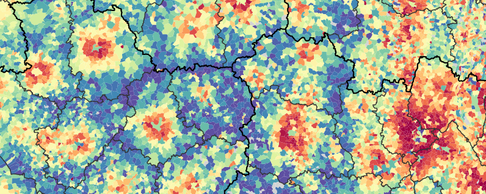

# france2json

This repository provides a number of reusable stuff and examples to make nice web maps of France. It is based on the <a href="http://professionnels.ign.fr/geofla" target="_blank">GEOFLA® dataset</a>, <a href="https://github.com/mbostock/topojson/wiki" target="_blank">TopoJSON format</a> and <a href="https://d3js.org/" target="_blank">D3.js</a> library. See these examples:
- <a href="http://jgaffuri.github.io/france2json/overview.html">Map of the communes of France</a>
- <a href="http://jgaffuri.github.io/france2json/revenues_map.html">Map of income by commune</a>

## File structure

The file <a href="/json">communes.json</a> provides 2 feature collections:

- 'communes' representing the communes with a polygonal geometry, with the following properties:
  - id: INSEE identifier, used to join statistical figures.
  - nom: Commune name
  - st: Statut of the commune, among:
    - s: Commune simple
    - o: Sous-préfecture
    - d: Préfecture de département
    - r: Préfecture de région
    - c: Capitale

- 'limites' representing the commune boundaries, with a single property 'na' (nature) whose values are among:
  - i: Frontière internationale
  - o: Limite côtière
  - r: Limite de région
  - d: Limite de département
  - a: Limite d'arrondissement
  - c: Limite de commune

The file <a href="/json">communes_nolim_oac.json</a> has the same content as communes.json, excluding limits of types 'o', 'a' and 'c', which are often useless to show on maps. The file <a href="/json">communes_surf.json</a> contains only the 'commune' geometries (surfaces), without any limit.

## Support and contribution

Feel free to [ask support](https://github.com/jgaffuri/france2json/issues/new), fork the project or simply star it (it's always a pleasure).

## Copyright

<a href="http://professionnels.ign.fr/geofla" target="_blank">GEOFLA® dataset</a> is copyrighted. See the <a href="http://professionnels.ign.fr/geofla" target="_blank">IGN website</a> for more information.
